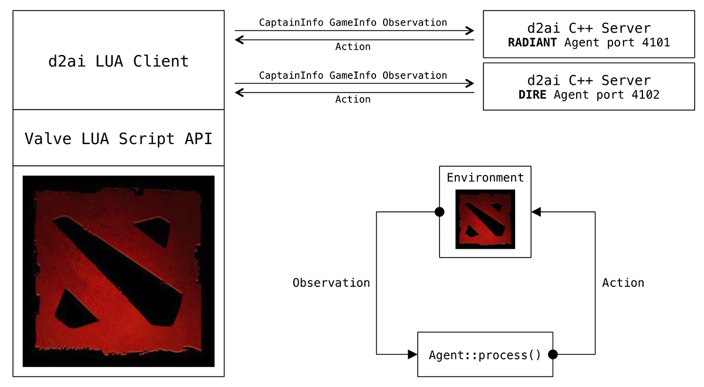

# d2ai

d2ai is a C++ API to develop intelligent agents playing Dota 2. It primarily supports the CAPTAINS mode as the standard format for tournament games. All types of games can be played in a dedicated lobby: AI vs. AI, AI vs. Valve Bot, or AI vs. human. ALL PICK mode is also supported for faster testing. The goal of this project is to provide an AI development framework comparable to the one available for StarCraft II. Radiant and Dire Agents continuously receive Observations of the world and return one or more Actions to achieve their goals.

## How it works

Dota 2 offers a built-in LUA scripting API. Scripts are executed in a limited LUA 5.1 virtual machine while the game is running. The limited virtual machine cannot import external C libraries, cannot use LUA IO functions, and does not support multithreading. The LUA scripting API is fine to develop basic rule-based bots using "if/then/else" logics, but it is unfortunately not appropriate to develop intelligent agents. Nevertheless, the LUA API provides a CreateHTTPRequest method that can be used to interface with other processes via HTTP. The d2ai API is therefore built on top of the LUA scripting API and consists of 2 components: a LUA client that sends Observation messages via HTTP, and a C++ server controlled by an Agent that processes Observations and returns Actions to the client. When using the d2ai API, you do not have to write code to create, encode, decode, send or receive messages, you only need to develop your Agent in C++.

---



---

Radiant and Dire HTTP servers run on different ports. Each Agent receives 3 types of messages:

* **CaptainInfo.** Provides a list of heroes that have been banned or picked during the selection phase. Virtual function `Agent::select()` returns the new hero to pick or ban depending on the phase.
* **GameInfo.** Provides data that are constant during the game (e.g. some building locations, list of players, enum values, etc). Message is sent only 1 time when the game starts and is automatically stored by Agent.
* **Observation.** Provides a full description of the world at a given time, including every existing unit with its abilities and items, as well as rune status, dropped items, etc. Virtual function `Agent::process()` returns a vector of Actions to be performed.

Overall, game data are stored in `CaptainInfo`, `GameInfo` and `Observation` classes. Your Agent must inherit from `Agent` and implements the 2 virtual functions `select()` and `process()`. The ~ 30 possible in-game Actions are available in `Action` class.

## Build & Install

The d2ai library uses CMake to generate project files and builds with Makefiles. It relies on 1 library:

* GNU Libmicrohttpd (https://www.gnu.org/software/libmicrohttpd/)

To build on Mac or Linux

```bash
git clone https://github.com/2aius/d2ai.git
cd d2ai
./build.sh
```

It may work on Windows using MinGW but it is currenlty untested. After make completed, you should have the sample agent `build/d2ai-passive` executable created. Finally, you need to link the Dota 2 `bots` directory to the d2ai's one:

```bash
cd ${DOTA2_DIR}/game/dota/scripts/vscripts
ln -s ${D2AI_DIR}/src-client/bots bots
```

Replace `${DOTA2_DIR}` (Steam subdirectory) and `${D2AI_DIR}` by their values in your system.

## How to start a game

### d2ai Settings

All settings can be set in `src-client/bots/config.lua`

If needed, specify the default server port for each team:

```lua
config.server[TEAM_RADIANT] = ":4101"
config.server[TEAM_DIRE] = ":4102"
```

Or enable random selection in CAPTAINS MODE (useful when playing vs. Valve Bots):

```lua
config.captainRandom[TEAM_RADIANT] = false
config.captainRandom[TEAM_DIRE] = false
```

You can also specify your default hero selection when playing in ALL PICK mode. This is useful for development and testing.

### Dota 2 Lobby Settings

Create a lobby and use the following settings for an AI vs. AI game:

* Game Mode: CAPTAINS MODE
* Starting Team: RADIANT
* Radiant/Dire Difficulty: PASSIVE (ignored)
* Radiant/Dire Bots: LOCAL DEV SCRIPT

Then run in a console (or use your own agent):

```bash
build/d2ai-passive 4101
build/d2ai-passive 4102
```

For an AI (Radiant) vs. Valve Bot (Dire) game:

* Game Mode: CAPTAINS MODE
* Starting Team: RADIANT
* Radiant Difficulty: PASSIVE (ignored)
* Radiant Bots: LOCAL DEV SCRIPT
* Dire Difficulty: PASSIVE / EASY / MEDIUM / HARD
* Dire Bots: DEFAULT BOTS

As Valve Bots do not support CAPTAINS MODE, you will also have to set in the config file:

```lua
config.captainRandom[TEAM_DIRE] = true
```

Then run in a console (or use your own agent):

```bash
build/d2ai-passive 4101
```

## Performances

Each hero being controlled will send an Observation to the Agent every ~ 130 msec in average. Most of the execution time is spent by CreateHTTPRequest LUA API function call (experiments show that execution time varies in practice from 50 to 400 msec). As the game runs at 30 frames per second, each hero performs an action every ~ 4 frames, or ~ 7 actions per second in average. Note that some actions are 'immediate' (e.g. purchase item, level ability) so a hero can perform many of them at the same time after processing 1 Observation. In an AI vs. AI game, the 10 heroes being controlled will extract a full description of the world (i.e. thousands of variables) every 130 msec, so expect the CPU load to be high.

## Agent Example

A sample 'passive' agent is provided with the library. It selects random heroes in CAPTAINS mode, and assigns a lane to each hero when the game start. Each hero simply moves to the lane front and does nothing else. The passive agent in defined in `PassiveAgent` class. The `main` function passes the Agent to the application Controller:

```cpp
PassiveAgent *agent = new PassiveAgent();
Controller controller(port, agent);
controller.start();
```

Use the same approach when creating your own Agent.
